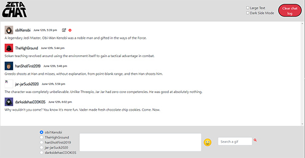
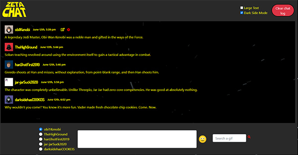
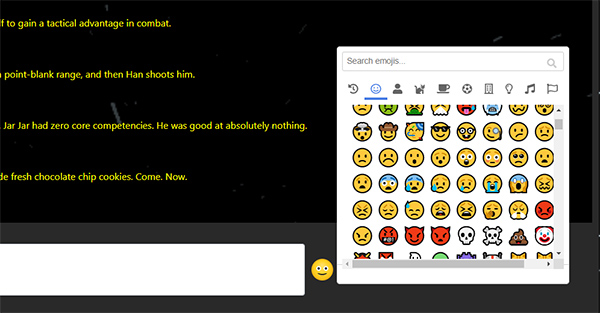
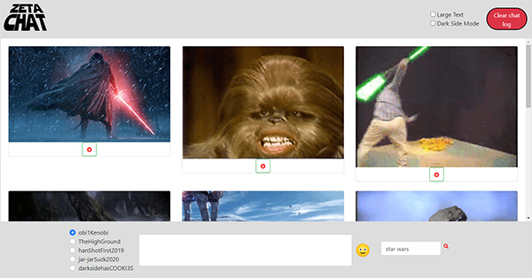
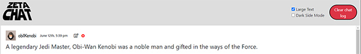

# NSS E12  Group Exercise - Star Wars Chat

## Description:
The objective of the group project was to create a Star Wars themed chat app using all that we have learned up to this point. The project uses Vanilla JS, JQuery, SASS, MomentJS, Axios, and Webpack.

## Star Wars Team: 
1. Austin Phy
1. Nikhil Gaikwad
1. Joshua Medlen
1. Matt Logan

## Features:
1. Chat has a light and dark mode.
1. Large text mode.
1. User messages are timestamped using MomentJS.
1. Users have the ability to edit or remove their messages.
1. User can clear all messages from the chat.
1. User can add an emoji to their message.
1. Users can search Giphy and add a gif to their message using Axios and the Giphy API.

## Screenshots:
##### Home Screet/ Light Mode

##### Darkside Mode

##### Add Emoji

##### Search Gifs

#### Large Text / Remove / Edit / Timestamp

